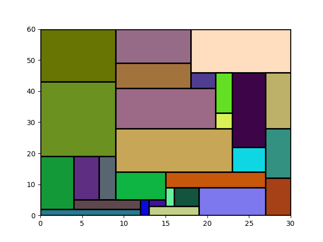

# VLSI Multi Paradigm Solver

Very large-scale integration (VLSI) is the process of integrating or embedding hundreds of thousands of transistors on a single silicon semiconductor microchip.



## Introduction

This is the project work of the Combinatorial Decision Making and Optimization course of the Master's degree in Artificial Intelligence of Univeristy of Bologna. 

The group members are:

| Name         | Surname      | Email                                 | 
| :----------: | :----------: | :-----------------------------------: | 
| Alessandro   | Lombardini   | alessandr.lombardin3@studio.unibo.it |
| Giacomo      | Melacini     | giacomo.melacini@studio.unibo.it      |
| Matteo       | Rossi Reich  | matteo.rossireich@studio.unibo.it     |
| Lorenzo      | Tribuiani    | lorenzo.tribuiani@studio.unibo.it     |


## Prerequisites

### CP
- **Minizinc**  
  Install [Minizinc IDE](https://www.minizinc.org/ide/) and add the bin folder to your System Path

- **Or-Tools**
  1. Download the *Or-Tools* flat-zinc from [Or-Tools Git Hub](https://github.com/google/or-tools/releases/tag/v9.3) (or_tools_flatzinc_VisualStudio-64bit_v9.3.10497.zip). 

  2. Extract the folder 

  3. Go on Minizinc IDE and go in: *Minizinc -> Preferences -> Solvers*

  4. Under the list of solvers select *Add new...*

  5. In the opening tab insert the following:

     - Name: *Or-Tools*
     - Solver-ID: *com.google.or-tools*
     - Version: *9.3.1*
     - Executable: *path to the bin extracted*
     - Solver library path: *add a new folder called **Or-Tools***
     - Select *-v* flag

   6. Click Add

### MIP

Install AMPL from [AMPL website](https://portal.ampl.com/account/ampl/login)

## Required Packages and installation
1. Clone repository

2.  Open a terminal

3. Create and activate a virtual environment with:

   ```python -m venv [name-of-venv]```

   ```./[name-of-venv]/Scripts/activate ```

4. Install the requirements with:

   ```pip install -r requirements.txt```  
   
5. Install MathSat and Z3 via pySMT following the instructions defined here https://pysmt.readthedocs.io/en/latest/getting_started.html  
 

## Usage

Once the project is installed, to run an execution give, from the root directory:  


 ```python main.py {CP, SAT, SMT, LP} ... [-h] [-v] [-i] [-p] [-r]```  

 In the following table all the optional and positional argument (shared or selective from paradigm) are reported:  

| TABLE OF COMMANDS ||                             |                |
| :-----------: | :------------: | :---------: | :------------: |
| Long argument | Short argument | Description | Allowed params |
| **OPTIONAL SHARED PARAMETERS** |                |             |                |
| *--verbose* | *-v* | Toggle verbosity | None |
| *--ins* | *-i* | Select instance to solve | 1-40<br />omit to execute all |
| *--print_img* | *-p* | Toggle image saving | None |
| *--rotation* | *-r* | Toggle solving with allowed rotation | None |
| **POSITIONAL ARGUMENTS** |                |             |                |
| paradigm |                | Select the solving paradigm | CP \| SAT \| SMT \| MIP |
| **CP REQUIRED ARGUMENTS** |                |             |                |
| *--model* | *-m* | Select CP model | std \| cml \| syb (one or more) |
| *--solver* | *-s* | Select CP solver | chuffed \| gecode \| or-tools (one or more) |
| **SAT REQUIRED ARGUMENTS** |  |  |  |
| *--model* | -m | Select SAT model | SATModel \| SATModelBorders |
| **SAT OPTIONAL ARGUMENTS** |  |  |  |
| *--symmetry_breaking* | *-sb* | Choose if the symmetry breaking constraint has to be used | None |
| *--encoding* | *-e* | Select SAT encoding | seq \| np \| bw \| he |
| **SMT REQUIRED ARGUMENTS** |  |  |  |
| *--model* | *-m* | Select SMT model | z3Py \| z3Py_rotation \| z3Py_parallel \| pySMT_z3 \| pySMT_msat |
| **MIP REQUIRED ARGUMENTS** |  |  |  |
| *--mode* | *-m* | Select MIP model | std \| strong (one or both) |
| *--solver* | *-s* | Select MIP solver | gurobi \| cplex \| copt \| highs \| xpress (one or more) |
| **MIP OPTIONAL ARGUMENTS** |  |  |  |
| *--ampl_dir* | *-a* | If the AMPL installation directory is not in the system search path, specify the full path to the AMPL installation directory | String with full path to AMPL installation dir |

